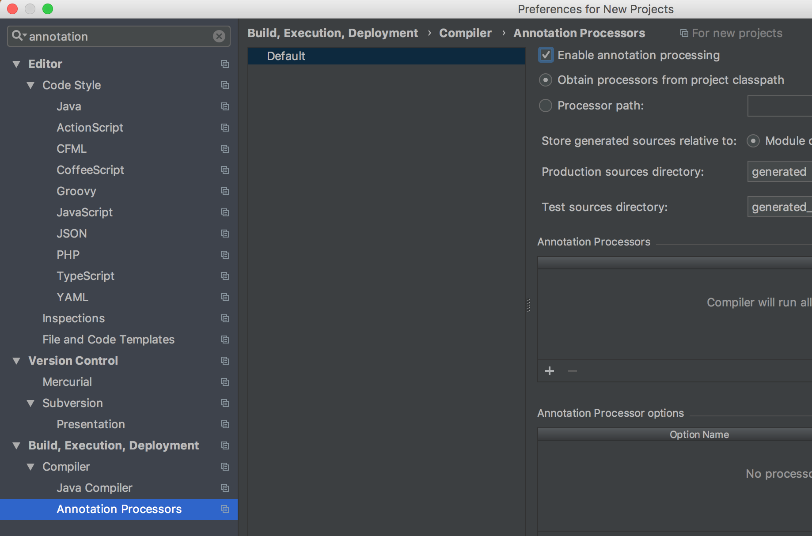

# SpringBootBank

Introduction to using Spring Boot, applying it to create a simple Bank application. <br>
<p>Currently incomplete: Latest ToDo:
<ul> <li>Previous tasks</li> 
<ul><li> finish currency total filter method</li></ul>
</ul> 

<h2 class="c7" id="h.yohf50x30eq6"><span class="c10">My remaining tasks:</span></h2><ul class="c2 lst-kix_xulgfxfa9a4c-0 start"><li class="c0 c1"><span class="c4">Users: Database</span></li></ul><ol class="c2 lst-kix_xulgfxfa9a4c-1 start" start="1"><li class="c0 c3"><span class="c4">Add password column</span></li><li class="c0 c3"><span class="c4">Add login [boolean] column</span></li><li class="c0 c3"><span class="c4">Add username column</span></li><li class="c0 c3"><span class="c4">Add Admin user credentials, logged in</span></li><li class="c0 c3"><span class="c4">Interest timestamp column: implements interest from time</span></li></ol><ul class="c2 lst-kix_xulgfxfa9a4c-0"><li class="c0 c1"><span class="c4">Functionality:</span></li></ul><ol class="c2 lst-kix_xulgfxfa9a4c-1 start" start="1"><li class="c0 c3"><span class="c4">Register as a new user to database</span></li><li class="c0 c3"><span class="c4">Login as an existing user. Boolean flag for being logged in.</span></li><li class="c0 c3"><span class="c4">Logout = boolean flag turning false.</span></li><li class="c0 c3"><span class="c4">Interest 0.05% , every account is bank a deposit account and will gain calculated interest every 2min.</span></li><li class="c0 c3"><span class="c4">Check balance: method that returns updated balance according to Interest gained.</span></li></ol><p class="c0 c11 c13"><span class="c4"></span></p><ul class="c2 lst-kix_xulgfxfa9a4c-0"><li class="c0 c1"><span class="c4">Admin logged in: </span></li></ul><ol class="c2 lst-kix_xulgfxfa9a4c-1 start" start="1"><li class="c0 c3"><span class="c4">admin credentials should by default be on the database</span></li><li class="c0 c3"><span class="c4">Can delete users</span></li></ol><ul class="c2 lst-kix_xulgfxfa9a4c-0"><li class="c0 c1"><span class="c4">Logged in user </span></li></ul><ol class="c2 lst-kix_xulgfxfa9a4c-1 start" start="1"><li class="c0 c3"><span class="c4">can withdraw money from their account</span></li></ol><p class="c0 c11"><span class="c4"></span></p><p class="c0 c11"><span class="c4"></span></p><h3 class="c8" id="h.2ufdxw39vcv"><span class="c9">Improvement steps proposed to achieve the tasks:</span></h3><h4 class="c5" id="h.u9jzvdbrlmnq"><span class="c6">Controllers:</span></h4><p class="c0"><span class="c4">AccountsController.java</span></p><ol class="c2 lst-kix_x2m074phlept-0 start" start="1"><li class="c0 c1"><span class="c4">Scope will be limited for filtering account statistics not adding users with accounts</span></li></ol><p class="c0 c11"><span class="c4"></span></p><p class="c0"><span class="c4">UserController.java</span></p><ol class="c2 lst-kix_a2mihg5ifgv7-0 start" start="1"><li class="c0 c1"><span class="c4">&ldquo;/add&rdquo; initial steps could be to add default &lsquo;account&rsquo; details, perhaps using setters before saving.</span></li></ol><ol class="c2 lst-kix_a2mihg5ifgv7-1 start" start="1"><li class="c0 c3"><span class="c4">Perhaps create additional mapping with the &ldquo;/actionToDo&rdquo; so that when adding new users you can also automatically define what currency their account will be in as well as their starting account balance money.</span></li></ol><h4 class="c5" id="h.qxolptkuhyg7"><span class="c6">DTO:</span></h4><p class="c0"><span class="c4">Account.java</span></p><ol class="c2 lst-kix_w7t4idpqv0fg-0 start" start="1"><li class="c0 c1"><span class="c4">&lsquo;account_num&rsquo; type is incorrect. However, with my current table setup perhaps this column should be dropped altogether as it may prove redundant?</span></li><li class="c0 c1"><span class="c4">FollowUp: is my one-to-one annotation setup correctly?</span></li></ol><p class="c0 c11"><span class="c4"></span></p><p class="c0"><span class="c4">User.java</span></p><ol class="c2 lst-kix_uh2lq3vw4hhd-0 start" start="1"><li class="c0 c1"><span class="c4">FollowUp: is my one-to-one annotation setup correctly here also?</span></li></ol><h4 class="c5" id="h.93qcm83j87pp"><span class="c6">Repositories: Update the &ldquo;Iterable&lt;&gt;&rdquo; accordingly</span></h4><p class="c0"><span class="c4">AccountsRepository.java</span></p><p class="c0"><span class="c4">UserRepository.java</span></p><h4 class="c5" id="h.86k69n5v0oc2"><span class="c6">MySQL database:</span></h4><p class="c0"><span class="c4">Is my database in its current setup correct for the tasks at hand? Is trial and error the only way to discover if this is the case at this current stage?</span></p>
## Getting Started

IntelliJ installed

Initial instructions [SQL I used](src/docs/sql_dump.sql) to get started.


### Prerequisites 
#### Dependencies:

Spring Boot starter data jpa added to pom.xml file.
```
<dependency>
            <groupId>org.springframework.boot</groupId>
            <artifactId>spring-boot-starter-data-jpa</artifactId>
</dependency>
```


### Installing

Create a new project with the following screenshots as a guide
<table>
    <tr>
        <td>
            
        </td>
        <td>
            
        </td>
        <td>
            
        </td>
<td></td>
    </tr>
<tr>
        <td>
            
        </td>
        <td>
            
        </td>
        <td>
            
        </td>
<td></td>
    </tr>
</table>


## Running the tests
JSON body sample for User object creation
```
{
    "name":"Alexander",
    "surname":"Rozhenko",
    "dob":"1987-04-10 03:40:00"
    "nationality":"Russia",
    "account_num":"004"
}
```

## Built With

* [Tomcat plugin](https://mvnrepository.com/artifact/org.apache.tomcat/tomcat-jdbc) - Server plugin
* [Lombok](https://mvnrepository.com/artifact/org.projectlombok/lombok) - plugin
* [JDBC](https://mvnrepository.com/artifact/org.apache.tomcat/tomcat-jdbc) - MySQL database

## Authors

* **Ryan Alexander** - *Initial work* - [LinkedIn](https://www.linkedin.com/in/rememberryan/)


## Acknowledgments

* SDA